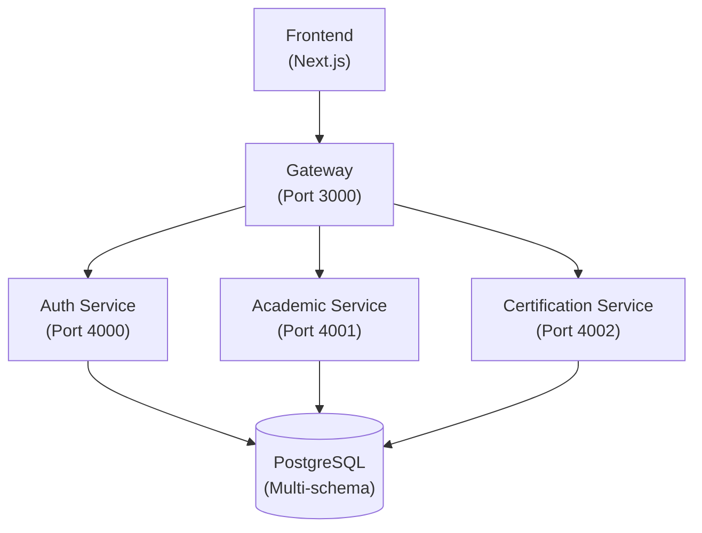

# nckh

Monorepo microservice cho dự án nckh.

## Kiến trúc

Dự án này tuân theo kiến trúc microservice sử dụng Git submodules. Mỗi service nằm trong repository riêng và có thể deploy độc lập, đồng thời được tích hợp tại đây để phát triển và điều phối local.



## Công nghệ sử dụng

- **Runtime**: Bun
- **Framework**: Hono (Services), Next.js (Frontend)
- **Database**: PostgreSQL với Drizzle ORM
- **Authentication**: Better-Auth
- **Secret Management**: Doppler
- **Linting/Formatting**: Biome
- **Git Hooks**: Lefthook
- **Ngôn ngữ**: TypeScript

## Các Services

| Service | Thư mục | Port | Schema | Mô tả |
|---------|---------|------|--------|-------|
| **Gateway** | `services/gateway` | 3000 | - | Điểm vào chính. Proxy requests đến các services. |
| **Auth** | `services/auth` | 4000 | `public` | Quản lý xác thực sử dụng Better-Auth với JWT. |
| **Academic** | `services/academic` | 4001 | `academic` | Quản lý khóa học, lớp học, sinh viên, giảng viên. |
| **Certification** | `services/certification` | 4002 | `certification` | Quản lý văn bằng, chứng chỉ, sổ gốc (Thông tư 21/2019). |
| **Frontend** | `frontend/web` | 5000 | - | Ứng dụng web Next.js. |

## Database Schema

### Auth Service (public schema)
- `user`, `session`, `account`, `verification`, `jwks`
- `organization`, `member`, `invitation`

### Academic Service (academic schema)
- `courses` - Chương trình đào tạo
- `classes` - Lớp học phần
- `enrollments` - Ghi danh học viên
- `waitlist` - Danh sách chờ (tuyển sinh cuốn chiếu)
- `lecturers` - Thông tin giảng viên
- `students` - Thông tin học viên

### Certification Service (certification schema)
- `registry_book` - Sổ gốc cấp văn bằng
- `certificate_types` - Loại chứng chỉ
- `certificate_blanks` - Phôi bằng
- `certificates` - Văn bằng đã cấp
- `certificate_correction_log` - Nhật ký chỉnh sửa
- `graduation_decisions` - Quyết định tốt nghiệp
- `blank_inventory_log` - Nhật ký xuất nhập phôi

### Shared Utilities

Thư mục `services/shared` chứa code và tiện ích dùng chung. Đây không phải là service chạy độc lập mà là thư viện được sử dụng bởi các service khác. Có thể thêm vào bất kỳ service nào bằng cách:

```bash
bun add shared@git+ssh://git@github.com:Ordinis-Borealopelta/shared-service.git#main
```

## Hướng dẫn cài đặt

### Yêu cầu

- Đã cài đặt Bun runtime
- Git được cấu hình với SSH access đến các repository của tổ chức
- PostgreSQL database
- Doppler CLI (cho secret management)

### Cài đặt

1. Clone repository cùng với tất cả submodules:

   ```bash
   git clone --recurse-submodules git@github.com:Ordinis-Borealopelta/nckh.git
   ```

2. Khởi tạo từng service:

   ```bash
   cd services/<tên-service>
   bun install
   bunx lefthook install
   ```

3. Cấu hình Doppler (xem phần Doppler Setup bên dưới)

4. Chạy migrations:

   ```bash
   doppler run -- bunx drizzle-kit migrate
   ```

## Doppler Setup

Dự án sử dụng Doppler để quản lý secrets một cách an toàn và tập trung.

### Cài đặt Doppler CLI

**Linux/macOS:**

```bash
curl -Ls https://cli.doppler.com/install.sh | sh
doppler login
```

**Windows (PowerShell):**

```powershell
# Option 1: Scoop
scoop install doppler

# Option 2: Winget
winget install DopplerHQ.doppler

# Then login
doppler login
```

### Cấu hình Doppler cho từng service

**Linux/macOS:**

```bash
./scripts/doppler-setup.sh
```

**Windows (PowerShell):**

```powershell
.\scripts\doppler-setup.ps1
```

Hoặc cấu hình thủ công:

```bash
cd services/<tên-service>
doppler setup --project nckh-<tên-service> --config dev
```

### Chạy với Doppler

```bash
bun run dev:doppler
```

### Cấu trúc Doppler Project

Dự án sử dụng một project Doppler duy nhất (`nckh`) chứa secrets cho các services:

| Secret | Mô tả |
|--------|-------|
| `AUTH_DATABASE_URL` | Connection string PostgreSQL cho Auth (schema: public) |
| `ACADEMIC_DATABASE_URL` | Connection string PostgreSQL cho Academic (schema: academic) |
| `CERTIFICATION_DATABASE_URL` | Connection string PostgreSQL cho Certification (schema: certification) |
| `BETTER_AUTH_SECRET` | Secret key cho Better-Auth |

Các config khác (ports, URLs) được hardcode với giá trị mặc định trong code.

### Chạy Local

Để khởi động service ở chế độ development (yêu cầu Doppler):

```bash
bun run dev
```

## Các Scripts

Mỗi service hỗ trợ các scripts sau:

| Script | Mô tả |
|--------|-------|
| `bun run dev` | Khởi động development với Doppler |
| `bun run start` | Khởi động production với Doppler |
| `bun run typecheck` | Kiểm tra TypeScript types |
| `bun run lint` | Chạy Biome linting |
| `bun run format` | Format code với Biome |
| `bun run format-and-lint` | Format và lint cùng lúc |

## Database Commands

| Command | Mô tả |
|---------|-------|
| `bunx drizzle-kit generate` | Tạo migration files |
| `bunx drizzle-kit migrate` | Chạy migrations |
| `bunx drizzle-kit push` | Push schema trực tiếp (dev only) |
| `bunx drizzle-kit studio` | Mở Drizzle Studio GUI |

## Health Checks

Mỗi service đều có endpoint `/health`. Gateway service tổng hợp trạng thái của tất cả services tại `/health`.

Ví dụ response từ Gateway `/health`:

```json
{
  "status": "ok",
  "services": {
    "auth": { "status": "ok", "latency": 12 },
    "academic": { "status": "ok", "latency": 8 },
    "certification": { "status": "ok", "latency": 10 }
  }
}
```

## Docker

Chạy toàn bộ stack với Docker Compose:

```bash
docker-compose up -d
```

Yêu cầu thiết lập biến môi trường Doppler token:

**Linux/macOS:**

```bash
export DOPPLER_TOKEN=dp.st.dev.xxx
docker-compose up -d
```

**Windows (PowerShell):**

```powershell
$env:DOPPLER_TOKEN="dp.st.dev.xxx"
docker-compose up -d
```
